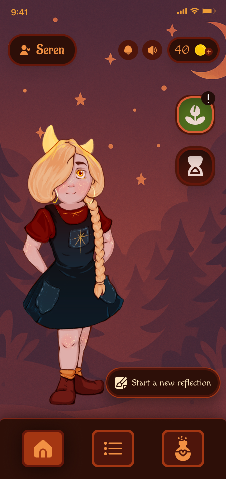
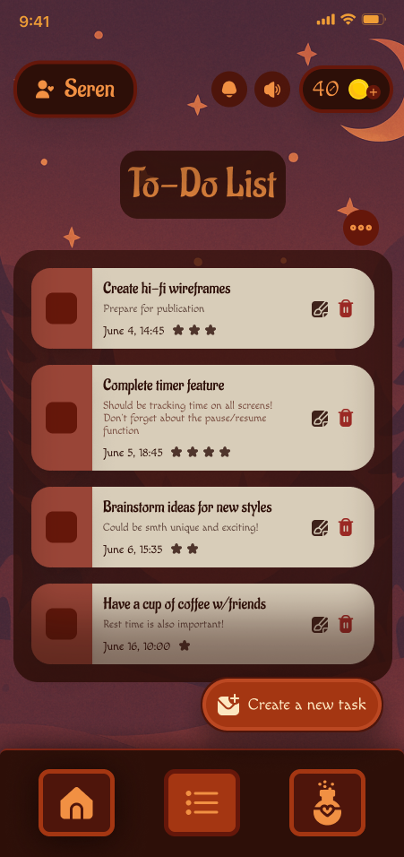
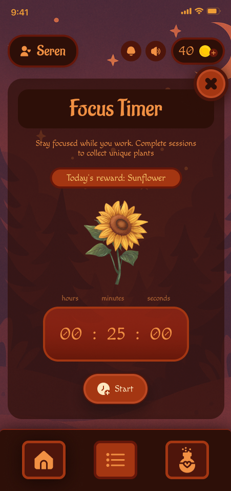

# 🌱 Gleamorrow | Gamified To-do List

A cozy, gamified habit tracker powered by $GLMW — focus and earn your way to a brighter routine. Built as a Telegram Mini App for the crypto community, Gleamorrow features Seren — a companion to help turn your daily tasks into collectible rewards and real progress.

> Note: This project shares select frontend snippets and UI logic for educational purposes. It is not open-source — see licensing below. Open-source support might become available in the future.

---

## ✨ Features

- 📋 Task Tracker — Create, complete, and manage tasks with star-based difficulty to earn coins
- ⏳ Focus Timer — Complete focus sessions to unlock collectibles
- 💰 $GLMW Coin — Earn rewards and complete milestones
- 🌻 Progress Garden — Unlock custom flowers based on your focus minutes
- 📱 Telegram Mini App — Works natively within Telegram; no extra downloads or installations
- 💬 Gamified UX — Receive extra boosts of dopamine for keeping track of your to-do list

---

## 🖼️ Screenshots

### 🌟 To-Do List

### 🌟 To-Do List

### ⏳ Focus Timer

### 🌻 Flower Unlock

---

## 🔗 Links

- 🌟 Telegram Mini App: [t.me/gleamorrow_bot](https://t.me/gleamorrow_bot)
- 💸 Token on Pump.fun: [pump.fun/coin/A4THR4bKPaPio2C9LnPrGCLxpQbG7h5mC6d2wnLBpump](https://pump.fun/coin/A4THR4bKPaPio2C9LnPrGCLxpQbG7h5mC6d2wnLBpump)
- 🚀 Join X: [gleamorrow.fun](https://gleamorrow.fun/)
- 🗨️ Join Telegram Community: [t.me/gleamorrow](https://t.me/gleamorrow)
- 🌐 Website: [gleamorrow.fun](https://gleamorrow.fun/)

---

## 📦 Tech Stack

- Frontend: React + Vite  
- Backend: Python Flask 
- APIs: Telegram WebApp API + custom endpoints

Find code previews with comments in *snippets/*

---

## ⚠️ License

This project is **not open-source**.  
The code and assets in this repository are shared for **educational and informational purposes only**.

> © 2025 Gleamorrow. All rights reserved.  
> You may not use, reproduce, or distribute any part of this project without explicit permission.  

---

## 📬 Get Involved

If you're a dev, artist, or crypto community member and want to collaborate or learn more, reach out on Telegram or X!

---

